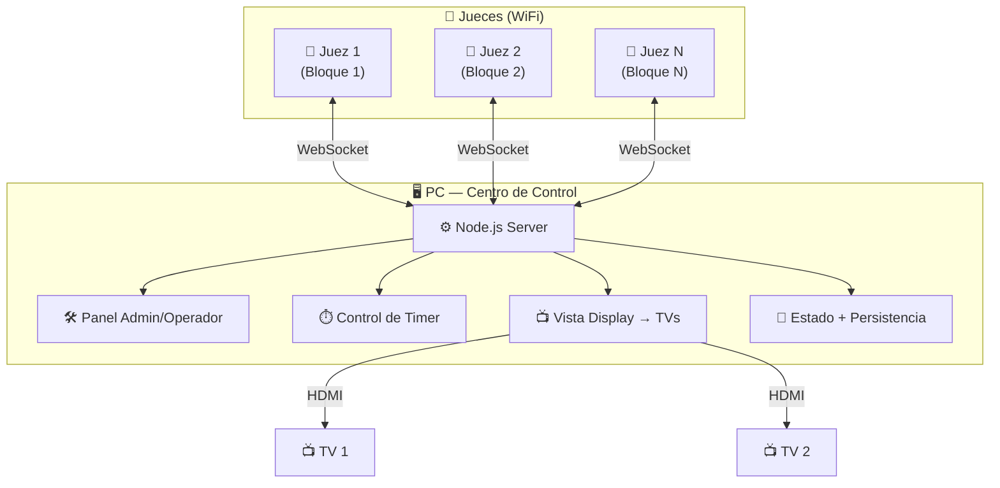
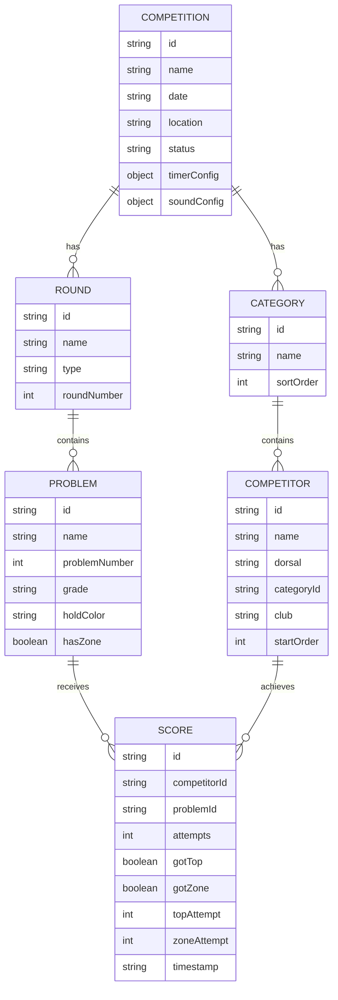

# 🧗 ClimbComp — Plan de Implementación

## Visión General

App web para gestionar competencias de escalada **Boulder**. Un servidor Node.js corre en la PC que controla todo y muestra el display en las TVs. Los jueces usan sus tablets/móviles como **terminales de entrada de datos** vía WiFi.

---

## Arquitectura



### Principio Fundamental

| Componente | Rol | Dónde corre |
|------------|-----|-------------|
| **PC** | Servidor + Admin + Operador + Timer + Display | Navegador de la PC |
| **Jueces** | Solo ingresan datos: TOP / ZONA / CAÍDA | Navegador del móvil/tablet |

> [!IMPORTANT]
> **Toda la lógica está en la PC.** Los jueces son terminales de entrada — no controlan timer, no ven rankings detallados, no configuran nada. Solo puntúan.

---

## Stack Técnico

| Aspecto | Decisión |
|---------|----------|
| **Servidor** | Node.js + `ws` (WebSocket, ~4KB, sin subdependencias) |
| **Frontend** | HTML + CSS + JavaScript vanilla |
| **Persistencia** | JSON en disco (auto-save) |
| **Audio** | Web Audio API (sonidos del timer en la PC) |
| **Comunicación** | WebSocket sobre WiFi local |
| **Conexión jueces** | QR code o IP manual en el navegador — sin instalar nada |
| **Internet** | NO necesario |

---

## Módulos Funcionales

### 1. 🖥️ Vista PC — Panel de Control + Display

La PC tiene una **interfaz dual**: panel de control a la izquierda y display público a la derecha (o en segunda ventana para las TVs).

```
┌──────────────────────────┬──────────────────────────────────┐
│   PANEL DE CONTROL       │       DISPLAY PÚBLICO (→ TV)     │
│                          │                                  │
│  🏆 Competencia activa   │          B L O Q U E  # 3       │
│  ├─ Nombre: Copa 2026    │                                  │
│  ├─ Ronda: Semifinal     │            03:24.7               │
│  └─ Estado: En curso     │          ESCALANDO 🟢            │
│                          │                                  │
│  ⏱ TEMPORIZADOR          │       #14 — MARÍA GARCÍA        │
│  ┌────────────────────┐  │       Senior Fem. — Club Andino  │
│  │     03:24.7        │  │                                  │
│  │    ESCALANDO 🟢    │  │   ZONA ✅ (int.1)  TOP ❌       │
│  └────────────────────┘  │         Intento: 3               │
│  [▶][⏸][⏹][⏭] [🔊]     │                                  │
│                          │  ┌──────────────────────────────┐│
│  👥 Competidor actual:   │  │ RANKING EN VIVO              ││
│  #14 María García        │  │ 1. #7  Pedro L.  T:3 Z:4    ││
│  ← Anterior | Siguiente →│  │ 2. #14 María G.  T:2 Z:3    ││
│                          │  │ 3. #22 Ana R.    T:2 Z:2    ││
│  📊 Resultados rápidos:  │  └──────────────────────────────┘│
│  B1: T✅ Z✅ | B2: T❌ Z✅│                                  │
│  B3: escalando...        │  Siguiente: #7 Pedro López      │
│                          │                                  │
│  📱 Jueces conectados: 4 │  📱 Conexión: 192.168.1.50:3000 │
│  🟢 J1 🟢 J2 🟢 J3 🟡 J4│  [QR CODE]                      │
│                          │                                  │
│  [⚙ Config] [📈 Rankings]│  ClimbComp v1.0                  │
│  [📤 Export] [💾 Backup]  │                                  │
└──────────────────────────┴──────────────────────────────────┘
```

**Secciones del Panel de Control:**

1. **Gestión de Competencia** — Crear, configurar categorías, rondas, bloques
2. **Gestión de Competidores** — Registrar, importar CSV, orden de salida
3. **Temporizador** — Control total (iniciar, pausar, detener, saltar) + sonidos
4. **Resultados** — Vista de todo lo que van reportando los jueces
5. **Rankings** — Clasificación en vivo por categoría
6. **Configuración** — Tiempos, sonidos, reglas de puntuación
7. **Monitor de Jueces** — Ver quién está conectado, estado de cada juez
8. **Export** — CSV, JSON, backup/restore

---

### 2. 📱 Vista Juez — Terminal de Datos (Móvil)

Interfaz **ultra-mínima**. El juez solo necesita hacer 3 cosas: marcar TOP, marcar ZONA, o registrar CAÍDA.

```
┌─────────────────────┐
│ ClimbComp    🟢 WiFi│
│ Bloque #3           │
├─────────────────────┤
│                     │
│   ⏱ 03:24           │
│                     │
│ #14 María García    │
│ Intento: 3          │
│ Zona: ✅ (int.1)    │
│                     │
│ ┌─────────────────┐ │
│ │                 │ │
│ │    🟢 TOP       │ │  ← Botón ENORME
│ │                 │ │
│ └─────────────────┘ │
│ ┌─────────────────┐ │
│ │                 │ │
│ │    🟡 ZONA      │ │  ← Botón ENORME
│ │                 │ │
│ └─────────────────┘ │
│ ┌─────────────────┐ │
│ │    ❌ CAÍDA     │ │
│ └─────────────────┘ │
│                     │
│ ┌────┐     ┌─────┐ │
│ │ ↩️ │     │ Sig.│ │
│ │Undo│     │  →  │ │
│ └────┘     └─────┘ │
└─────────────────────┘
```

**Características de la vista juez:**
- 3 botones gigantes (TOP, ZONA, CAÍDA) — mínimo 80px de alto
- Timer visible (solo lectura, sincronizado desde la PC)
- Info del competidor actual (nombre + dorsal + intento)
- Botón **Undo** — deshacer último registro (por error)
- Navegación entre competidores (si el juez gestiona la cola en su bloque)
- Indicador de conexión WiFi (🟢 conectado / 🔴 desconectado)
- **Vibración** al registrar un resultado (feedback táctil)
- **Wake Lock** — la pantalla no se apaga
- **Cola offline** — si pierde WiFi, guarda acciones y sincroniza al reconectar

---

### 3. ⏱️ Sistema de Temporizador

Controlado **exclusivamente desde la PC**. Los jueces solo lo ven.

#### Modos de Operación

| Modo | Descripción |
|------|-------------|
| **Automático** | Preparación → Escalada → Pausa → Siguiente (sin tocar nada) |
| **Semi-automático** | Auto dentro de un bloque, espera confirmación entre competidores |
| **Manual** | El operador controla cada fase |

#### Fases y Tiempos Configurables

| Fase | Default | Rango | Sonido |
|------|---------|-------|--------|
| Preparación | 60s | 10-300s | Beep suave al iniciar |
| Advertencia pre-inicio | 10s antes del fin de prep. | 3-30s | Beep doble |
| **Escalada** | **240s (4 min)** | 60-600s | **Bocina fuerte al iniciar** |
| Advertencia pre-fin | 30s antes del fin | 5-60s | Beep rápido repetido |
| **Fin de tiempo** | — | — | **Bocina doble** |
| Pausa/Transición | 120s | 0-600s | Beep suave |

#### Sonidos Configurables

- Sonidos predefinidos generados con Web Audio API (sin archivos)
- Opción de cargar MP3/WAV personalizados
- Control de volumen
- Preview de cada sonido desde configuración
- Sonido de confirmación para TOP y ZONA

#### Atajos de Teclado (PC)

| Tecla | Acción |
|-------|--------|
| `Espacio` | Iniciar / Pausar |
| `Escape` | Detener y resetear |
| `→` | Saltar a siguiente fase |
| `R` | Reiniciar bloque actual |
| `M` | Mute/Unmute |
| `T` | Registrar TOP (operador también puede) |
| `Z` | Registrar ZONA |
| `F` | Fullscreen display |

---

### 4. 📊 Sistema de Resultados

**Por competidor por bloque:**
- Intentos totales
- ¿Logró TOP? → En qué intento
- ¿Logró ZONA? → En qué intento
- Timestamp de cada acción

**Ranking (sistema IFSC estándar, configurable):**
1. Más Tops
2. Menos intentos a Top (desempate)
3. Más Zonas
4. Menos intentos a Zona (desempate)

---

### 5. 🔌 Comunicación WebSocket

#### Mensajes Juez → PC

```javascript
// Juez reporta resultado
{ type: "score", data: { competitorId, problemId, result: "top"|"zone"|"fall", attempt: 3 }}

// Juez deshace última acción
{ type: "undo", data: { competitorId, problemId }}

// Juez pide siguiente competidor
{ type: "next_competitor", data: { problemId }}
```

#### Mensajes PC → Jueces

```javascript
// Sincronización de timer
{ type: "timer", data: { phase: "climbing", remaining: 204700, total: 240000 }}

// Competidor actual
{ type: "current_competitor", data: { id, name, dorsal, attempt, hasZone, hasTop }}

// Confirmación de score
{ type: "score_confirmed", data: { competitorId, problemId, result }}

// Cambio de estado de competencia
{ type: "state_update", data: { round, problem, status }}
```

---

## Modelo de Datos



---

## Estructura de Archivos

```
climbing-comp/
├── server.js                  ← Servidor Node.js (HTTP + WebSocket + Estado)
├── package.json               ← Dependencia: "ws" + "qrcode" (opcional)
│
├── public/
│   ├── pc/                    ← Todo lo que corre en la PC
│   │   ├── index.html         ← Panel de control + display integrado
│   │   ├── pc.css             ← Layout dual (control + display)
│   │   ├── pc.js              ← Lógica del panel
│   │   ├── timer.js           ← Motor del temporizador
│   │   ├── audio.js           ← Sistema de sonidos
│   │   ├── rankings.js        ← Cálculo de rankings
│   │   └── export.js          ← Exportación CSV/JSON
│   │
│   ├── judge/                 ← Lo que se sirve a los móviles
│   │   ├── index.html         ← Interfaz ultra-mínima
│   │   ├── judge.css          ← Mobile-first, botones enormes
│   │   └── judge.js           ← WebSocket + cola offline
│   │
│   └── shared/
│       ├── variables.css      ← Design tokens
│       └── ws-client.js       ← Cliente WebSocket con auto-reconexión
│
├── data/
│   └── state.json             ← Auto-guardado del estado completo
│
└── README.md
```

---

## Fases de Implementación

### Fase 1 — Servidor + Esqueleto
- `server.js` — HTTP + WebSocket + gestión de estado
- Estructura base de archivos
- Conexión WebSocket básica con auto-reconexión

### Fase 2 — Panel PC: Gestión de Datos
- CRUD competencias, categorías, competidores, bloques
- Persistencia en JSON
- UI del panel de control

### Fase 3 — Temporizador
- Motor del timer (fases, modos, configuración)
- Sistema de sonidos (Web Audio API)
- Sincronización del timer a clientes WebSocket
- Atajos de teclado

### Fase 4 — Vista Juez
- Interfaz móvil ultra-mínima
- Envío de scores (TOP/ZONA/CAÍDA)
- Undo, vibración, wake lock
- Cola offline para desconexiones

### Fase 5 — Display + Rankings
- Vista pública para TVs (timer grande, competidor, ranking)
- Cálculo de rankings en vivo
- Animaciones de transición

### Fase 6 — Pulido
- Export CSV/JSON
- Backup/restore
- QR code para conexión de jueces
- Pruebas con datos reales

---

## Verification Plan

### Manual Verification
- Simular competencia completa: 5 competidores, 4 bloques, 2 jueces en móvil
- Verificar sincronización de timer entre PC y móviles
- Verificar que los scores aparecen instantáneamente en el display
- Probar desconexión WiFi del juez y reconexión con cola
- Verificar rankings con escenarios de desempate
- Probar en Chrome móvil (Android) y Safari (iOS)
- Verificar sonidos en la PC
- Verificar persistencia al reiniciar el servidor

---

## Open Questions

1. **¿Sistema de puntuación?** — ¿IFSC estándar (Tops > intentos Top > Zonas > intentos Zona) o reglas propias?

2. **¿Formato de rotación?** — ¿Competidores rotan por bloques con tiempo fijo, o todos los bloques abiertos simultáneamente?

3. **¿Idioma?** — ¿Solo español o español + inglés?

4. **¿La PC tiene Node.js?** — Si no, puedo preparar la instalación o hacer un ejecutable.

5. **¿Categorías típicas?** — ¿Cuáles usas normalmente? (para precargarlas como defaults)
