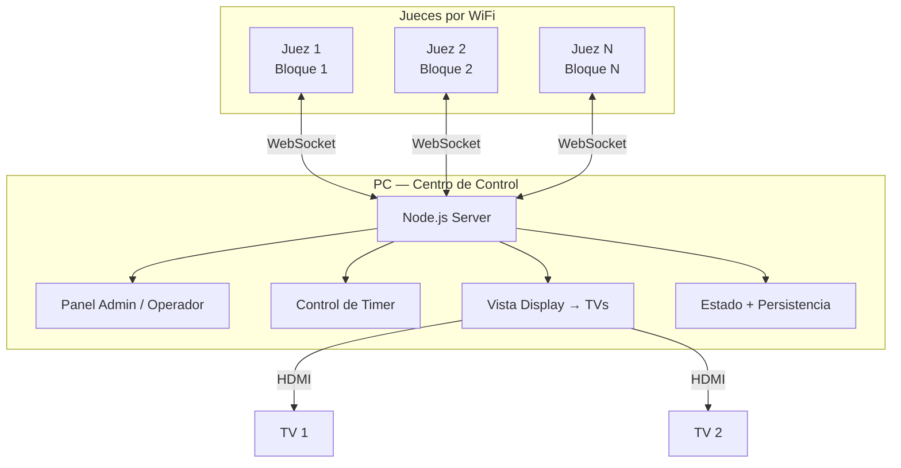
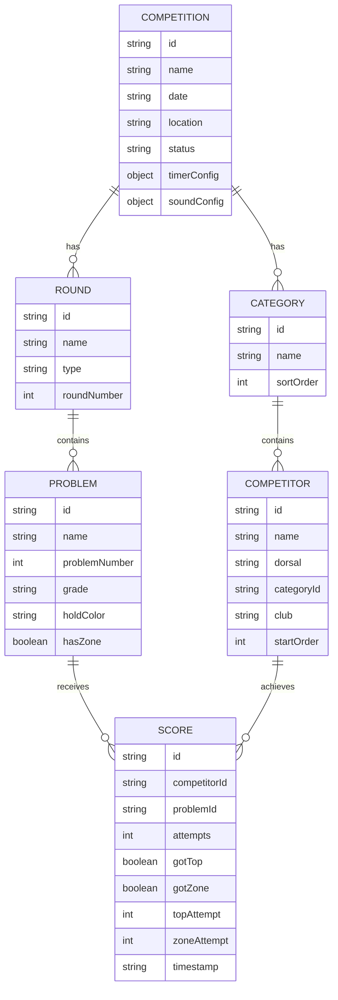

# ClimbComp — Plan de Implementación

> **Documento revisado y maquetado para exportación a PDF**  
> Plataforma web para gestión de competencias de escalada Boulder con panel central en PC, terminales de jueces por WiFi, timer sincronizado y display público.

---

## Resumen ejecutivo

ClimbComp está planteado como una aplicación web local para operar competencias de escalada Boulder sin depender de internet. El servidor corre en una PC central que concentra la lógica, el estado del evento, el temporizador, la visualización pública y la administración general.

Los jueces utilizan móviles o tablets como terminales ligeras de carga de datos. Ese enfoque reduce complejidad operativa, evita errores de configuración distribuida y deja el control crítico del evento en un único punto.

### Objetivos del sistema

- Operar competencias Boulder de forma simple y robusta.
- Centralizar timer, scoring, ranking y display en una sola PC.
- Permitir a los jueces cargar resultados desde cualquier dispositivo con navegador.
- Funcionar en red local sin necesidad de internet.
- Mantener una experiencia clara, rápida y resistente a desconexiones.

---

## Arquitectura general

### Esquema lógico



### Principio operativo

| Componente | Rol principal | Entorno de ejecución |
|---|---|---|
| **PC central** | Servidor, administración, operación, timer y display | Navegador o entorno local de la PC |
| **Jueces** | Carga de TOP, ZONA y CAÍDA | Navegador del móvil o tablet |

> **Regla clave:** toda la lógica crítica vive en la PC. Los jueces no configuran el evento, no controlan el timer y no gestionan rankings globales. Solo reportan resultados.

---

## Stack técnico

| Área | Decisión técnica | Motivo |
|---|---|---|
| **Servidor** | Node.js + `ws` | Ligero, simple y suficiente para WebSocket local |
| **Frontend** | HTML + CSS + JavaScript vanilla | Menos dependencia, menos fricción, despliegue simple |
| **Persistencia** | JSON en disco | Fácil backup, inspección y restore |
| **Audio** | Web Audio API | Sonidos sin necesidad de motor externo |
| **Comunicación** | WebSocket por WiFi local | Sincronización en tiempo real |
| **Acceso de jueces** | QR o IP directa | Sin instalación de app |
| **Internet** | No requerido | Operación offline/local |

---

## Módulos funcionales

### 1. Panel de control en PC

La PC concentra dos vistas: operación interna y display público. Puede mostrarse en layout dual o separarse en una segunda ventana para TV o proyector.

#### Funciones del panel

- Gestión de competencia: crear evento, categorías, rondas y bloques.
- Gestión de competidores: alta manual, importación CSV y orden de salida.
- Control del timer: iniciar, pausar, resetear, avanzar fase, silenciar.
- Supervisión de scoring: ver lo que reportan los jueces en tiempo real.
- Ranking en vivo por categoría o ronda.
- Configuración general de tiempos, sonidos y reglas.
- Monitor de conectividad de jueces.
- Exportación y backup.

#### Distribución conceptual de pantalla

| Zona | Contenido esperado |
|---|---|
| **Columna izquierda** | Competencia activa, timer, competidor actual, acciones rápidas, estado de jueces |
| **Columna derecha** | Display público, ranking vivo, siguiente competidor, datos visibles para pantallas externas |

### 2. Vista de juez en móvil o tablet

La vista del juez debe ser deliberadamente mínima. El objetivo no es “darle funcionalidades”, sino eliminar errores bajo presión.

#### Requisitos de interfaz

- Botones muy grandes para **TOP**, **ZONA** y **CAÍDA**.
- Timer visible en modo solo lectura.
- Identificación clara del competidor actual.
- Indicador de intento actual.
- Acción de **Undo** para corrección inmediata.
- Estado de conexión visible.
- Vibración de confirmación al registrar eventos.
- Wake Lock para evitar apagado de pantalla.
- Cola offline temporal para reconexión.

### 3. Sistema de temporizador

El timer debe estar centralizado por completo en la PC. Los clientes remotos reciben sincronización, pero no autoridad.

#### Modos de operación

| Modo | Comportamiento |
|---|---|
| **Automático** | Encadena preparación, escalada, pausa y siguiente competidor |
| **Semi-automático** | Automatiza fases internas, pero espera confirmación entre competidores |
| **Manual** | El operador controla cada transición |

#### Fases y tiempos configurables

| Fase | Valor de referencia | Rango sugerido | Señal sonora |
|---|---:|---:|---|
| Preparación | 60 s | 10–300 s | Beep suave al inicio |
| Advertencia preinicio | 10 s antes del fin | 3–30 s | Beep doble |
| **Escalada** | **240 s** | 60–600 s | Bocina fuerte al iniciar |
| Advertencia prefin | 30 s antes del fin | 5–60 s | Beep rápido repetido |
| Fin de tiempo | 0 s | — | Bocina doble |
| Pausa / transición | 120 s | 0–600 s | Beep suave |

#### Requisitos del timer

- Sincronización por WebSocket hacia todos los clientes.
- Estado visible: preparación, escalando, pausa, finalizado.
- Sonidos configurables.
- Control de volumen.
- Atajos de teclado para operación rápida.
- Soporte para pausa, reset y salto de fase.

#### Atajos recomendados

| Tecla | Acción |
|---|---|
| `Espacio` | Iniciar o pausar |
| `Escape` | Detener y resetear |
| `→` | Siguiente fase |
| `R` | Reiniciar bloque |
| `M` | Mute / unmute |
| `T` | Registrar TOP desde operador |
| `Z` | Registrar ZONA desde operador |
| `F` | Fullscreen del display |

### 4. Sistema de resultados

El sistema de scoring debe almacenar por cada competidor y por cada bloque:

- Intentos totales.
- Si logró TOP.
- En qué intento logró TOP.
- Si logró ZONA.
- En qué intento logró ZONA.
- Timestamp de cada evento.

#### Ranking base sugerido

1. Más Tops.
2. Menos intentos a Top.
3. Más Zonas.
4. Menos intentos a Zona.

### 5. Comunicación en tiempo real

La app necesita una capa de mensajes simple, legible y robusta.

#### Eventos de juez hacia servidor

```javascript
{ type: "score", data: { competitorId, problemId, result: "top" | "zone" | "fall", attempt: 3 } }
{ type: "undo", data: { competitorId, problemId } }
{ type: "next_competitor", data: { problemId } }
```

#### Eventos de servidor hacia jueces

```javascript
{ type: "timer", data: { phase: "climbing", remaining: 204700, total: 240000 } }
{ type: "current_competitor", data: { id, name, dorsal, attempt, hasZone, hasTop } }
{ type: "score_confirmed", data: { competitorId, problemId, result } }
{ type: "state_update", data: { round, problem, status } }
```

---

## Modelo de datos



### Entidades principales

| Entidad | Función |
|---|---|
| **Competition** | Configuración global del evento |
| **Category** | Segmentación deportiva |
| **Competitor** | Participante individual |
| **Round** | Instancia competitiva: clasificación, semi, final |
| **Problem** | Bloque o problema de búlder |
| **Score** | Resultado puntual del atleta en un bloque |

---

## Estructura de archivos propuesta

```text
climbing-comp/
├── server.js
├── package.json
├── public/
│   ├── pc/
│   │   ├── index.html
│   │   ├── pc.css
│   │   ├── pc.js
│   │   ├── timer.js
│   │   ├── audio.js
│   │   ├── rankings.js
│   │   └── export.js
│   ├── judge/
│   │   ├── index.html
│   │   ├── judge.css
│   │   └── judge.js
│   └── shared/
│       ├── variables.css
│       └── ws-client.js
├── data/
│   └── state.json
└── README.md
```

### Criterios de organización

- Separar claramente experiencia PC, experiencia juez y utilidades compartidas.
- Mantener `server.js` como punto central de orquestación.
- Guardar el estado persistente fuera de `public/`.
- Evitar complejidad temprana con frameworks innecesarios.

---

## Roadmap de implementación

### Fase 1 — Base del sistema

- Servidor HTTP.
- Canal WebSocket.
- Estado en memoria.
- Auto-guardado a JSON.
- Estructura inicial del proyecto.

### Fase 2 — Gestión de datos en PC

- CRUD de competencias.
- CRUD de categorías.
- CRUD de competidores.
- CRUD de bloques.
- Importación inicial desde CSV.

### Fase 3 — Timer y audio

- Motor de fases.
- Modos de operación.
- Sincronización del reloj.
- Sonidos y alertas.
- Hotkeys.

### Fase 4 — Interfaz de juez

- Layout móvil.
- Botones grandes.
- Reporte de score.
- Undo.
- Cola offline.
- Reconexión automática.

### Fase 5 — Display y ranking

- Display público.
- Ranking en vivo.
- Estado del competidor actual.
- Vista de siguiente competidor.
- Transiciones visuales.

### Fase 6 — Pulido final

- Export CSV y JSON.
- Backup / restore.
- QR de acceso para jueces.
- Test operativo con datos reales.
- Ajustes UX de campo.

---

## Plan de validación

### Pruebas manuales mínimas

| Escenario | Qué validar |
|---|---|
| Competencia simulada con 5 atletas y 4 bloques | Flujo completo de operación |
| 2 jueces en móvil simultáneamente | Consistencia del score concurrente |
| Timer visible en PC y móviles | Sincronización correcta |
| Corte y regreso de WiFi | Reintento y cola offline |
| Empates | Ranking y desempates |
| Android y iPhone | Compatibilidad móvil real |
| Reinicio del servidor | Persistencia del estado |

---

## Riesgos y observaciones

### Riesgos operativos

- Dependencia de una sola PC como punto central.
- Problemas de WiFi local en espacios muy cargados.
- Errores humanos de jueces bajo presión.
- Latencia perceptible en dispositivos viejos.
- Diferencias de comportamiento entre navegadores móviles.

### Mitigaciones recomendadas

- Auto-save agresivo y backups manuales rápidos.
- Cola offline en terminales de jueces.
- UI extremadamente simple.
- Confirmaciones visuales y hápticas.
- Ensayo completo antes del evento real.

---

## Preguntas abiertas

1. ¿El sistema de puntuación será IFSC puro o tendrá ajustes propios?
2. ¿La rotación será por tiempo fijo entre bloques o con bloques abiertos?
3. ¿El producto debe ser solo en español o bilingüe?
4. ¿La PC objetivo ya tiene Node.js o se necesita empaquetado ejecutable?
5. ¿Qué categorías conviene dejar precargadas por defecto?

---

## Recomendación práctica

La dirección técnica es correcta para un MVP robusto: servidor local, WebSocket, UI ligera y control centralizado. Lo más importante no es agregar más features al principio, sino asegurar cuatro cosas desde el día uno: **timer confiable, scoring consistente, reconexión limpia y display legible**.

Si esas cuatro piezas funcionan bien, el sistema ya sirve en una competencia real. Todo lo demás es mejora incremental.
